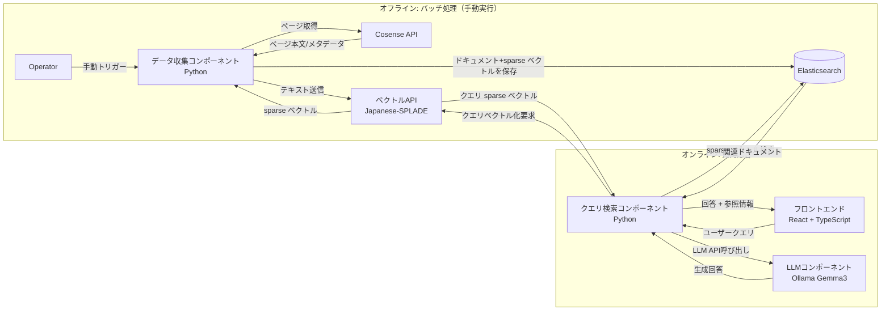

# RAG システム アーキテクチャ

## 1. 目的と仕様サマリ

本ドキュメントは、Cosense をデータソースとする RAG（Retrieval-Augmented Generation）システムのアーキテクチャを定義します。  
本システムは、事前に構築した検索インデックス（Elasticsearch）と LLM を組み合わせて、ユーザー質問に対して根拠付きの回答を生成します。

- データは Cosense API から手動トリガーのバッチ処理で取得する。
- 取得データはベクトル API でベクトル化し、Elasticsearch に保存する。
- ユーザー問い合わせ時はクエリをベクトル化して Elasticsearch を検索する。
- 検索結果を LLM（Ollama Gemma3）に渡して回答を生成する。
- フロントエンド（React + TypeScript）で問い合わせと回答表示を行う。

---

## 2. アーキテクチャ概要

システムは以下 5 つのアプリケーションコンポーネントと、検索基盤・運用基盤で構成されます。

1. データ収集コンポーネント（Batch Ingestion）
2. ベクトル API コンポーネント（Embedding）
3. クエリ検索コンポーネント（Retrieval）
4. LLM コンポーネント（Generation Service）
5. フロントエンドコンポーネント（UI）

実装ディレクトリ（現行構成）:

- `batch_ingestion/`
- `embedding/`
- `retrieval/`
- `llm_generation/`
- `frontend/`

補助基盤:

- Elasticsearch（sparse vector 検索 + メタデータ格納）
- Docker / docker-compose（ローカル・検証環境）
- GitHub Actions（CI/CD）
- Sentry（監視・エラートラッキング）

---

## 3. 全体フロー図



---

## 4. コンポーネント詳細と責務

### 4.1 データ収集コンポーネント

**責務**
- Cosense API から対象データを取得
- 前処理（不要文字除去、チャンク分割、メタデータ付与）
- ベクトル API を呼び出して文書の sparse ベクトルを生成
- Elasticsearch へインデックス登録

**入出力**
- 入力: 手動実行トリガー、Cosense API 応答
- 出力: Elasticsearch インデックス済みドキュメント（本文、メタデータ、sparse ベクトル）

**設計ポイント**
- 冪等な Upsert で再実行安全性を確保
- 更新日時ベースの差分取り込みを考慮
- 失敗時はリトライと失敗ログ記録を実装

### 4.2 ベクトル API コンポーネント（Embedding: `embedding/`）

**責務**
- テキストのベクトル化 API を提供
- バッチ取り込み・オンライン検索の両経路から利用される共通サービス

**入出力**
- 入力: テキスト（文書またはクエリ）
- 出力: sparse ベクトル（疎な埋め込み表現）

**設計ポイント**
- Japanese-SPLADE を利用して日本語テキストをベクトル化
- 同一前処理を文書・クエリの双方で適用し、sparse 表現の一貫性を維持
- スループット向上のため、バッチ推論をサポート

### 4.3 クエリ検索コンポーネント（Retrieval: `retrieval/`）

**責務**
- フロントエンドからクエリを受け取る
- ベクトル API によりクエリを sparse ベクトル化
- Elasticsearch で sparse ベクトル検索（Top-K）
- LLM 向けプロンプトを構築し、LLM コンポーネントを API 経由で呼び出して回答生成する

**入出力**
- 入力: ユーザークエリ
- 出力: 回答本文、参照ドキュメント情報（タイトル・URL など）

**設計ポイント**
- 既定値は `top_k=5`、`score_threshold=0.20` とし、必要に応じてリクエストで上書き可能にする
- `score_threshold` 以上の文書が 1 件もない場合は、フォールバック文言「該当情報が見つからないため、回答できませんでした。」を返す
- citation は検索順位順で返し、`url + title` キーで重複排除する
- LLM 呼び出し既定値は `timeout=30s`、`retry=2`、`max_tokens=512` とする

### 4.4 LLM コンポーネント（LLM Generation: `llm_generation/`）

**責務**
- Retrieval から受け取ったコンテキストで回答生成する API を提供

**使用モデル**
- Ollama Gemma3

**設計ポイント**
- システムプロンプトで「与えられたコンテキスト優先」を明示
- 回答は Retrieval 側で citation と結合して返す
- タイムアウト・トークン上限・失敗時再試行は Retrieval 側の呼び出しポリシーで制御

### 4.5 フロントエンドコンポーネント

**責務**
- ユーザー入力フォームと回答表示 UI を提供
- 回答本文と参照元情報を見やすく表示

**設計ポイント**
- 入力中・検索中・回答完了・エラー時の状態管理を明確化
- 参照文書リンクを表示して根拠確認を支援
- エラー発生時に再試行導線を提供

---

## 5. ワークフロー詳細

### 5.1 バッチ処理（手動実行）

1. オペレーターがバッチ処理を手動実行
2. データ収集コンポーネントが Cosense API から必要データを取得
3. 取得データを前処理・チャンク化（既定値: `chunk_size=800` 文字、`chunk_overlap=100` 文字）
4. ベクトル API にチャンクを送信し sparse ベクトル化
5. 文書チャンク・メタデータ・sparse ベクトルを Elasticsearch に保存
6. 実行ログ（成功件数/失敗件数/経過時間）を記録

### 5.2 オンライン質問応答処理

1. ユーザーがフロントエンドでクエリを入力
2. クエリ検索コンポーネントがクエリを受信
3. ベクトル API でクエリを sparse ベクトル化
4. Elasticsearch で sparse ベクトル類似検索を実行
5. 上位の関連ドキュメントを抽出
6. Retrieval が LLM API にクエリ + 検索コンテキストを渡す
7. LLM コンポーネントが回答を生成
8. Retrieval が回答と参照情報をフロントエンドに返却して表示

---

## 6. 技術スタック

| レイヤー | 技術 |
|---|---|
| データ収集コンポーネント | Python, Cosense API |
| ベクトルAPIコンポーネント | Python, Japanese-SPLADE |
| クエリ検索コンポーネント | Python, Elasticsearch Python Client |
| LLMコンポーネント | Python, Ollama Gemma3 |
| フロントエンド | React + TypeScript |
| 検索データベース | Elasticsearch |
| インフラ | Docker, docker-compose |
| CI/CD | GitHub Actions |
| 監視 | Sentry |

---

## 7. API/データ設計（最小構成案）

### 7.1 ベクトル API

- `POST /embed`
  - request: `{ "texts": ["..."], "type": "document|query" }`
  - response: `{ "vectors": [{ "token_123": 1.245, "token_42": 0.556 }, { "token_987": 0.731 }] }`

### 7.2 クエリ検索 API

- `POST /search`
  - request: `{ "query": "...", "top_k": 5, "score_threshold": 0.20 }`
  - response: `{ "answer": "...", "citations": [{ "title": "...", "url": "..." }] }`
  - defaults:
    - `top_k=5`
    - `score_threshold=0.20`
    - `fallback_message="該当情報が見つからないため、回答できませんでした。"`
    - `llm_timeout_seconds=30`
    - `llm_retry_count=2`
    - `llm_max_tokens=512`

### 7.3 LLM Generation API

- `POST /generate`
  - request: `{ "query": "...", "contexts": [{ "content": "...", "title": "...", "url": "..." }] }`
  - response: `{ "answer": "..." }`

### 7.3 Elasticsearch ドキュメント例

```json
{
  "doc_id": "cosense:page:123#chunk:0",
  "title": "ページタイトル",
  "url": "https://scrapbox.io/...",
  "content": "チャンク本文",
  "updated_at": "2026-03-10T00:00:00Z",
  "sparse_vector": {
    "token_123": 1.245,
    "token_987": 0.731,
    "token_42": 0.556
  }
}
```

---

## 8. 非機能要件・運用

- 可観測性:
  - Sentry で API 例外、タイムアウト、外部 API 失敗を収集
  - 構造化ログで `trace_id` を全リクエストに付与
  - MVP 必須ログ項目: `trace_id`, `service`, `operation`, `dependency`, `status_code`, `duration_ms`, `retry_count`, `error_type`, `error_message`
- セキュリティ:
  - Cosense API トークン、LLM 接続設定は環境変数管理
  - 通信経路は TLS を前提とする
- 運用:
  - docker-compose でローカル再現環境を統一
  - GitHub Actions で静的解析・テスト・ビルドを自動化

---

## 9. 注意事項（重要）

- Elasticsearch と Python クライアントはバージョン互換性を必ず確認すること。
  - 本プロジェクトは Elasticsearch 8 系列の最新安定版を採用し、Python クライアントも 8 系列の最新安定版に合わせる。
- インデックス設定（`sparse_vector` の定義、類似度計算、インデックスオプション）は、Japanese-SPLADE の出力仕様と一致させること。
- 将来的にモデル差し替えを行う場合、語彙表現や重み付け仕様の差異により再インデックスが必要になる可能性がある。

---

## 10. 今後の拡張候補

- ハイブリッド検索（BM25 + sparse ベクトル検索）
- 再ランキング導入（Cross-Encoder など）
- 回答キャッシュとレート制限
- バッチのスケジューラ化（手動実行から定期実行へ移行）
