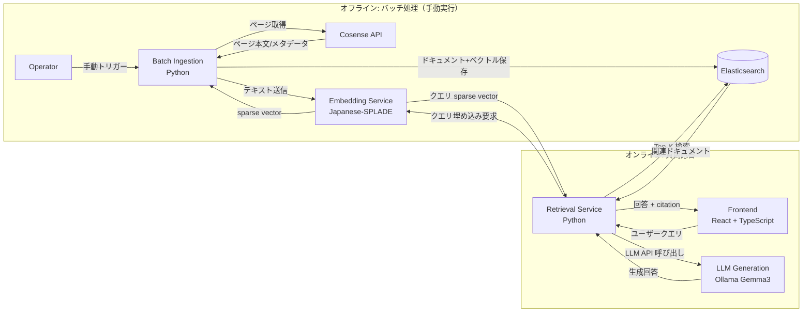

# Cosense RAG システム仕様書

## 1. ドキュメント目的

本仕様書は、Cosense をデータソースとする RAG（Retrieval-Augmented Generation）システムの仕様を定義する。  
本システムは、オフラインで構築した検索インデックスを用い、オンラインで根拠付き回答を返すことを目的とする。

## 2. 適用範囲

- 対象システム: Cosense ベース RAG
- 運用形態:
  - オフライン: 手動トリガーのバッチ取り込み
  - オンライン: ユーザー質問に対する検索・生成応答
- 主な利用者:
  - オペレーター（バッチ実行、運用監視）
  - エンドユーザー（質問入力、回答閲覧）

## 3. 用語定義

- sparse vector: 疎な語彙重み表現
- Top-K: 検索で上位 K 件を取得する方式
- citation: 回答根拠として返す参照情報

## 4. システム全体構成

### 4.1 コンポーネント

1. Batch Ingestion（Python）
2. Embedding Service（Python / Japanese-SPLADE）
3. Retrieval Service（Python / Elasticsearch）
4. LLM Generation（Python / Ollama Gemma3）
5. Frontend（React + TypeScript）

### 4.2 補助基盤

- Elasticsearch（sparse vector 検索 + メタデータ格納）
- Docker / docker-compose（開発・検証環境）
- GitHub Actions（CI/CD）
- Sentry（監視・エラートラッキング）

### 4.3 アーキテクチャ図



## 5. 機能仕様

### 5.1 Batch Ingestion

#### 責務

- Cosense API から対象ページを取得する
- テキスト前処理、チャンク分割、メタデータ付与を行う
- Embedding Service で文書を sparse vector 化する
- Elasticsearch に Upsert で保存する

#### 処理要件

- 手動トリガーで実行されること
- チャンク既定値は `chunk_size=800` 文字、`chunk_overlap=100` 文字とすること
- 冪等性を確保すること（再実行で不整合を起こさない）
- 更新日時ベースの差分取り込みを考慮すること
- 失敗時は再試行と失敗ログ記録を行うこと

### 5.2 Embedding Service

#### 責務

- 文書・クエリのテキストを sparse vector 化する API を提供する

#### 処理要件

- Japanese-SPLADE を利用すること
- 文書・クエリに同一前処理を適用すること
- バッチ推論に対応し、スループットを確保すること

### 5.3 Retrieval Service

#### 責務

- フロントエンドからクエリを受け取る
- クエリを sparse vector 化し、Elasticsearch で Top-K 検索する
- 検索結果から LLM 向けコンテキストを構築する
- LLM Generation API を呼び出し回答を取得する
- 回答と citation を返却する

#### 処理要件

- 既定値は `top_k=5`、`score_threshold=0.20` とすること（入力で上書き可能）
- `score_threshold` 以上の文書が 1 件もない場合、フォールバック文言「該当情報が見つからないため、回答できませんでした。」を返すこと
- citation は検索順位順で返し、`url + title` キーで重複排除すること
- LLM 呼び出し既定値を `timeout=30s`、`retry=2`、`max_tokens=512` とすること

### 5.4 LLM Generation

#### 責務

- Retrieval Service から受け取った検索コンテキストを優先して回答を生成する API を提供する

#### 処理要件

- 利用モデルは Ollama Gemma3 とする
- プロンプトでコンテキスト優先を明示する
- citation の整形・重複排除・返却順制御は Retrieval Service 側で行う
- タイムアウト・トークン上限・再試行は Retrieval Service 側の呼び出しポリシーで制御する

### 5.5 Frontend

#### 責務

- 質問入力 UI と回答表示 UI を提供する
- 回答本文と citation を表示する

#### 処理要件

- 状態（入力中/検索中/完了/エラー）を明確に管理する
- citation リンクを表示する
- エラー時の再試行導線を提供する

## 6. シーケンス仕様

### 6.1 オフライン取り込みフロー

1. オペレーターがバッチ処理を手動実行する
2. Batch Ingestion が Cosense API からページを取得する
3. 前処理・チャンク化を行う
4. Embedding Service へチャンクを送信して sparse vector を取得する
5. Elasticsearch に本文・メタデータ・sparse vector を保存する
6. 成功件数/失敗件数/処理時間をログ出力する

### 6.2 オンライン質問応答フロー

1. ユーザーがフロントエンドでクエリを送信する
2. Retrieval Service がクエリを受信する
3. Embedding Service がクエリを sparse vector 化する
4. Retrieval Service が Elasticsearch で Top-K 検索する
5. Retrieval Service が取得文書をコンテキスト化して LLM Generation API に送る
6. LLM Generation が回答を生成する
7. Retrieval Service が回答と citation をフロントエンドに返却する

## 7. API 仕様（最小構成）

### 7.1 Embedding API

- Endpoint: `POST /embed`
- Request:

```json
{
  "texts": ["ドキュメント本文", "クエリ文字列"],
  "type": "document"
}
```

- Response:

```json
{
  "vectors": [
    {"token_123": 1.245, "token_42": 0.556},
    {"token_987": 0.731}
  ]
}
```

### 7.2 Search API

- Endpoint: `POST /search`
- Request:

```json
{
  "query": "仕様書の更新手順は？",
  "top_k": 5,
  "score_threshold": 0.2
}
```

- Response:

```json
{
  "answer": "回答本文",
  "citations": [
    {
      "title": "ページタイトル",
      "url": "https://scrapbox.io/..."
    }
  ]
}
```

- Defaults:
  - `top_k=5`
  - `score_threshold=0.20`
  - `fallback_message="該当情報が見つからないため、回答できませんでした。"`
  - `llm_timeout_seconds=30`
  - `llm_retry_count=2`
  - `llm_max_tokens=512`

### 7.3 LLM Generation API

- Endpoint: `POST /generate`
- Request:

```json
{
  "query": "仕様書の更新手順は？",
  "contexts": [
    {
      "content": "関連チャンク本文",
      "title": "ページタイトル",
      "url": "https://scrapbox.io/..."
    }
  ]
}
```

- Response:

```json
{
  "answer": "回答本文"
}
```

## 8. データ仕様

### 8.1 Elasticsearch ドキュメント構造

```json
{
  "doc_id": "cosense:page:123#chunk:0",
  "title": "ページタイトル",
  "url": "https://scrapbox.io/...",
  "content": "チャンク本文",
  "updated_at": "2026-03-10T00:00:00Z",
  "sparse_vector": {
    "token_123": 1.245,
    "token_987": 0.731,
    "token_42": 0.556
  }
}
```

## 9. 非機能要件

### 9.1 可用性・耐障害性

- 外部依存（Cosense API / Embedding API / LLM）失敗を前提とする
- タイムアウト、再試行、フォールバックを実装する

### 9.2 可観測性

- Sentry で例外、タイムアウト、外部 API 失敗を収集する
- 構造化ログで全リクエストに `trace_id` を付与してトレース可能にする
- MVP 必須ログ項目を `trace_id`, `service`, `operation`, `dependency`, `status_code`, `duration_ms`, `retry_count`, `error_type`, `error_message` とする

### 9.3 セキュリティ

- API トークン、接続情報は環境変数で管理する
- 機密情報をコード・ログへ出力しない
- 通信は TLS を前提とする

### 9.4 互換性

- Elasticsearch 8 系列の最新安定版を採用し、Python クライアントも 8 系列の最新安定版に合わせる
- `sparse_vector` 仕様を埋め込みモデル出力と一致させる

## 10. 運用仕様

### 10.1 ローカル/検証環境

- docker-compose で実行環境を統一する

### 10.2 CI/CD

- GitHub Actions で静的解析・テスト・ビルドを自動実行する

### 10.3 障害対応

- エラー発生時は Sentry とログで原因を特定する
- 一時障害は再試行、継続障害はフォールバック応答で縮退運転する

## 11. 制約事項

- 回答生成は常に検索コンテキスト優先とする
- citation の追跡可能性を維持する
- 低関連時の「情報不足」フォールバックを維持する

## 12. 今後の拡張候補

- ハイブリッド検索（BM25 + sparse vector）
- 再ランキング（Cross-Encoder）
- 回答キャッシュとレート制限
- バッチ定期実行（スケジューラ化）

---

## 付録A. 最小検証手順

1. バッチを手動実行し、Elasticsearch への登録件数を確認する
2. `POST /search` で既知クエリを実行し、回答と citation が返ることを確認する
3. 検索ヒットが低いクエリで「情報不足」フォールバックが返ることを確認する
4. 外部 API 障害を模擬し、タイムアウト/再試行/エラーログが機能することを確認する